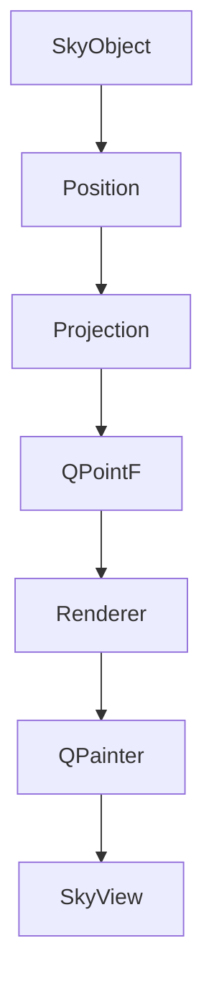
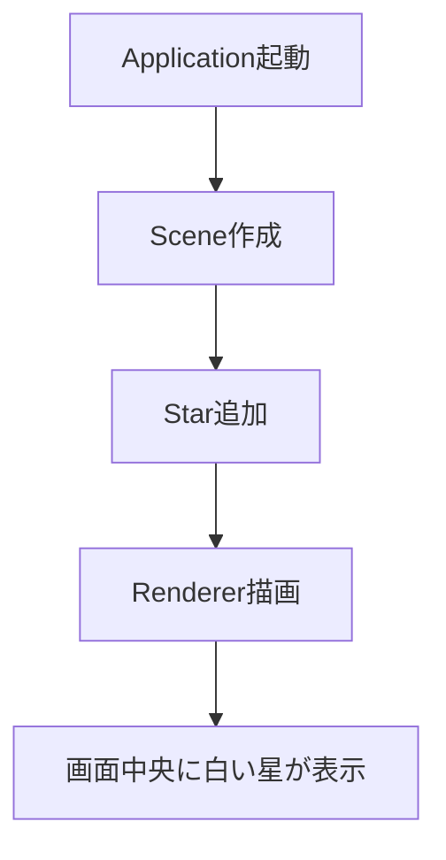
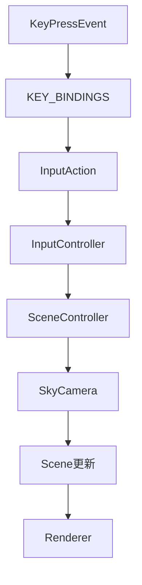
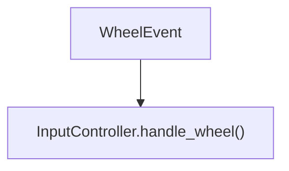
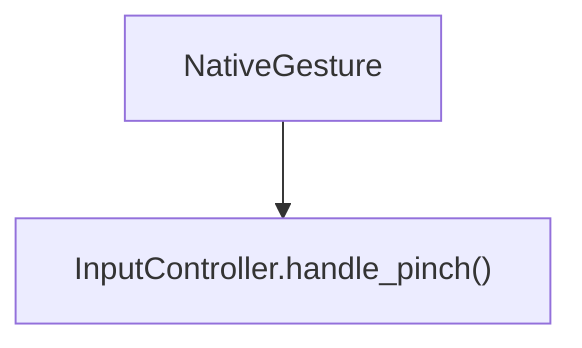
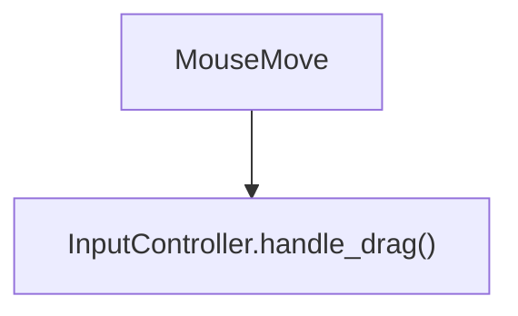
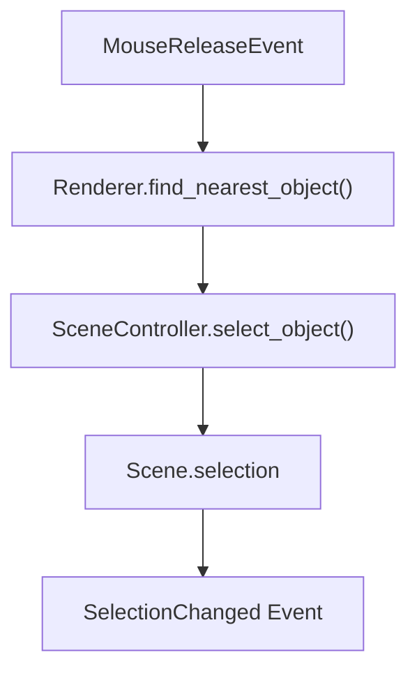
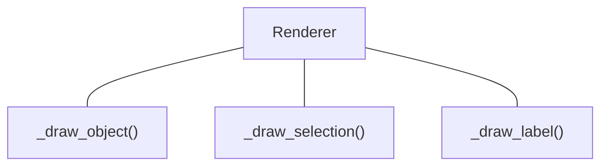
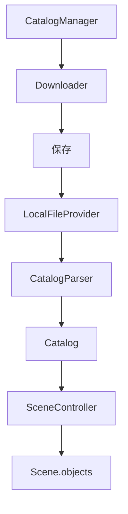

# 結合ファイル構成案内

このファイルは以下の順序で結合されています：

1. `docs/implementation/03_first_rendering.md`
2. `docs/implementation/04_camera_control.md`
3. `docs/implementation/05_selection.md`
4. `docs/implementation/06_catalog.md`

---


--- 
## ファイル名: `docs/implementation/03_first_rendering.md`
---

# First Rendering

## 1. 目的
SceneからSkyObjectを取得し、Projectionを経由してRendererがSkyViewへ描画できることを確認する。
初期実装では LinearProjection を採用する。これは開発・デバッグを容易にするための単純な線形投影であり、将来的に OrthographicProjection などの球面投影へ置き換えることを前提とする。

## 2. 完成した機能
- Scene
- SceneController
- SkyObject
- Star
- Position
- Magnitude
- SkyCamera
- Projection
- LinearProjection
- Renderer
- SkyView


## 3. 描画パイプライン




## 4. 実装内容
### Scene
現在の空の状態を保持するデータクラス。

#### 責務
- Time
- Observer
- SkyCamera
- SKyObject
- LayerManager
- Selection
- Focus
の管理

#### 責務ではないこと
- データ変更
- イベント発行
- 描画


### SceneController
Sceneを書き換える唯一の窓口。

#### 責務
- Sceneの状態を書き換える
- EventBusへイベントを発行する
- GUIやRendererから直接Sceneを書き換えさせない

#### 現在のメソッド
- ``__init__(self, scene: Scene, event_bus: EventBus):``
- ``scene(self) -> Scene (getter)``
- ``set_time(self, time: Time) -> None``
- ``set_observer(self, observer: Observer) -> None``
- ``add_object(self, sky_object: SkyObject) -> None``
- ``remove_object(self, sky_object: SkyObject) -> None``
- ``select_object(self, sky_object: SkyObject) -> None``
- ``clear_selection(self) -> None``
- ``set_focus(self, sky_object: SkyObject) -> None``
- ``clear_focus(self) -> None``

#### 責務ではないこと
- 描画
- 座標計算
- 天体位置計算
- GUI操作

### Renderer

Sceneを画面へ描画する。

#### 責務
- Sceneを読み取る
- Projectionへ座標変換を依頼する
- QPainterへ描画命令を送る
- 現時点では、``_draw_background()``, ``_draw_objects()``のみ実装

#### 責務ではないこと
- Sceneの変更
- 座標計算
- SkyObjectの更新

### Projection
天球座標を画面座標へ変換する。

入力
- Position
- SkyCamera
- Viewportサイズ

出力
- QPointF
- 画面外の場合はNone

責務ではないこと
- 描画
- 天体計算

### SkyObject

表示対象となる天体の基底クラス。

保持する情報
- id
- name
- object_type
- position
- magnitude

現在は固定天体のみ想定している。

将来的には動的天体
(ISS・惑星・月など)
は別クラスへ分離する予定。

## 5. 決定事項
- Positionは内部ではRA/Dec管理、必要に応じて他の座標系へ変換
- Magnitudeはfloatではなく、Magnitudeクラスで管理
- Eventは以下を使用
```
TIME_CHANGED
OBSERVER_CHANGED
OBJECT_ADDED
OBJECT_REMOVED
SELECTION_CHANGED
FOCUS_CHANGED
LAYER_CHANGED
CAMERA_CHANGED
MOUNT_CHANGED
```

- RendererはSkyObjectの具体的な描画処理を各 ``_draw_xxx()`` メソッドへ委譲する。``render()``・``_draw_objects()``・``_draw_object()`` の構造は今後も原則変更せず、新しいSkyObject型を追加する場合は対応する ``_draw_xxx()`` を追加することで拡張する。


## 6. 動作確認


## 7. 設計思想
- Sceneはデータのみ保持する
- SceneControllerのみSceneを書き換える
- RendererはSceneを変更しない
- Projectionは座標変換のみ担当する
- GUIはRendererへ描画を依頼するだけ

## 8. 現在の制約
- Projectionは中心座標のみ対応
- OrthographicProjectionのみ存在
- Starのみ描画確認済み
- 星表は未実装
- Camera移動は未実装

- 複数のSkyObjectを描画し、等級によって大きさが変えれるようになった

## 9. 次の実装予定
- Projectionの本実装
- RA/Dec→画面座標
- Camera移動
- マウスドラッグ
- Layer描画


--- 
## ファイル名: `docs/implementation/04_camera_control.md`
---

# Camera Control

## 1. 目的
ユーザーが視点を自由に移動・拡大縮小できるようにする。
描画系(Renderer)と入力系(Input)を分離する。

## 2. 前提
03 First Rendering
Scene
SkyCamera
Projection

## 3. 完成した機能
- ```SkyCamera.move()```
- ```SkyCamera.zoom()```
- ```Position.moved()```
- ```Position.normalized()```
- ```SceneController.move_camera()```
- ```SceneController.zoom_camera()```
- ```InputController```
- ```InputAction```
- ```KEY_BINDINGS```
- ```SkyView.keyPressEvent()```
- ```SkyView.wheelEvent()```
- ```SkyView.mousePressEvent()```
- ```SkyView.mouseMoveEvent()```
- ```SkyView.mouseReleaseEvent()```
- ```SkyView.event()``` (NativeGesture)
Macトラックパッドのピンチズーム
マウスドラッグによる視点移動

## 4. 実装したクラス
### ```Position```

#### 追加

- ```moved()```
- ```normalized()```

#### 役割

座標操作を担当する。


### ```SkyCamera```

#### 追加

- ```move()```
- ```zoom()```
- ```project()```

#### 役割

カメラ状態を保持する。
Projectionへ変換処理を委譲する。
SceneController

#### 追加

- ```move_camera()```
- ```zoom_camera()```

#### 役割

Sceneを書き換える唯一の窓口。
InputController

#### 追加

- ```handle_action()```
- ```handle_wheel()```
- ```handle_pinch()```
- ```handle_drag()```

#### 役割

入力をScene操作へ変換する。
### ```InputAction```

#### 役割

入力操作の列挙。

例
- ```MOVE_UP```
- ```MOVE_DOWN```
- ```MOVE_LEFT```
- ```MOVE_RIGHT```
- ```ZOOM_IN```
- ```ZOOM_OUT```
- ```ROTATE_LEFT```
- ```ROTATE_RIGHT```
- ```RESET_CAMERA```
- ```KEY_BINDINGS```

### 役割

キー入力とInputActionを対応付ける。

SkyView

### 追加

- ```keyPressEvent()```
- ```wheelEvent()```
- ```mousePressEvent()```
- ```mouseMoveEvent()```
- ```mouseReleaseEvent()```
- ```event()```

### 役割

QtイベントをInputControllerへ渡す。


## 5. 処理の流れ
キー入力



ホイール


ピンチ



ドラッグ


## 6. 設計判断
### 採用した設計
- InputControllerを導入し、GUIとSceneControllerを直接結び付けない。
- SkyCameraがProjectionを保持する。
- SkyCamera.project()でProjectionへ委譲する。
- Position自身が移動・正規化を行う。

### 採用しなかった設計
- RendererからProjectionを直接呼び出す。
- SkyViewからSceneControllerを直接操作する。

### 理由
責務を分離し、Projectionや入力方式を変更しても他のクラスへの影響を最小限にするため。


## 7. 変更したファイル

ここには実際に変更したファイルを列挙します。

例

- ``camera/sky_camera.py``
- ``sky/position.py``
- ``scene/scene_controller.py``
- ``input/input_controller.py``
- ``input/input_action.py``
- ``input/key_bindings.py``
- ``gui/sky_view.py``
- ``event/event_type.py``

## 8. TODO
- カメラ回転
- 慣性スクロール
- ドラッグ方向の設定
- タッチ操作の追加

## 9. この実装で得られたこと
- カメラを自由に操作できるようになった。
- 入力方式を追加しやすい構造になった。
- GUIとSceneの責務を分離できた。

## 10. 次に実装するもの
- Object Selection
- Label表示
- Catalog System


--- 
## ファイル名: `docs/implementation/05_selection.md`
---

# Selection

## 1. 目的
- 描画された天体をマウスで選択できるようにする。
- 選択された天体を Scene に保持し、他の機能から利用できるようにする。

## 2. 前提
- 03 First Rendering
- 04 Camera Control

## 3. 完成した機能
- ``Scene.selection``
- ``SceneController.select_object()``
- ``Renderer._find_nearest_object()``
- ``Renderer._draw_selection()``
- ``Renderer._draw_label()``
- ``SkyView.mouseReleaseEvent()``
- ``SelectionChanged Event``

## 4. 実装したクラス
### ``Selection``

#### 役割

現在選択されている天体を保持する。

#### 保持するもの

- `selected`
- `SceneController`

#### 追加

- `select_object()`

#### 役割

Selection を変更する唯一の窓口。

### ```Renderer```

#### 追加

- `_find_nearest_object()`
- `_draw_selection()`
- `_draw_label()`

#### 役割
- 選択対象の探索
- 選択マーカー描画
- ラベル描画
- SkyView

#### 追加
`mouseReleaseEvent()`

#### 役割

クリックされた座標から天体を選択する。

## 5. 処理の流れ
### 選択



### 描画



## 6. 設計判断
### 採用した設計
- Selection は Scene が保持する。
- Renderer は選択状態を参照するだけにする。
- Selection は 1 個だけ保持する。
### 採用しなかった設計
- Renderer が選択状態を保持する。
- 複数選択を最初から実装する。
### 理由
Scene がアプリケーション全体の状態を管理するため。


## 7. 変更したファイル
例
- scene/selection.py
- scene/scene.py
- scene/scene_controller.py
- rendering/renderer.py
- gui/sky_view.py
- event/event_type.py

## 8. TODO
- 複数選択
- 選択優先順位
- ラベル表示条件
- Hover表示
- タッチ選択

## 9. この実装で得られたこと
- 任意の天体をクリックして選択できるようになった。
- 選択状態を他機能から利用できるようになった。
- ラベル表示の基礎が完成した。

## 10. 次に実装するもの
Catalog System


--- 
## ファイル名: `docs/implementation/06_catalog.md`
---

# Catalog


## 1. 目的
- 外部カタログを読み込み、Sceneへ登録できる仕組みを作る。
- Catalog の種類を増やしても既存コードを変更しなくて済む設計にする。

## 2. 前提
- 03 First Rendering
- 04 Camera Control
- 05 Selection

## 3. 完成した機能
- `Catalog`
- `CatalogManager`
- `CatalogProvider`
- `LocalFileProvider`
- `CatalogParser`
- `SceneController.load_catalog()`
- `Downloader`

## 4. 実装したクラス
### `Catalog`

#### 役割
`SkyObject` の集合を表す。
#### 保持するもの
`name`
`objects`


### `CatalogProvider`
#### 役割
`Catalog` を取得する共通インターフェース。


### `LocalFileProvider`
#### 役割
ローカルファイルから `Catalog` を生成する。

### `CatalogParser`
#### 役割
ファイル形式を `Catalog` へ変換する。

### `CatalogManager`
#### 役割
`Catalog` の取得・保存を管理する。

### `Downloader`
#### 役割
ネットワークからファイルを取得する。

### `SceneController`
#### 追加
- `load_catalog()`

#### 役割
`Catalog` の内容を `Scene` へ追加する。

## 5. 処理の流れ
読み込み



## 6. 設計判断
### 採用した設計
- `Provider` と `Parser` を分離する。
- `CatalogManager` がダウンロードを担当する。
- `Catalog` は `SkyObject` の集合のみを保持する。
### 採用しなかった設計
- `Provider` が `Parser` を兼ねる。
- `Parser` がファイルを開く。
- `Catalog` がファイルパスを保持する。
### 理由
責務を分離し、新しい形式や取得方法を容易に追加できるようにするため。


## 7. 変更したファイル
例
- catalog/catalog.py
- catalog/catalog_manager.py
- catalog/provider/catalog_provider.py
- catalog/provider/local_file_provider.py
- catalog/parser/catalog_parser.py
- network/downloader.py
- scene/scene_controller.py

## 8. TODO
- ネットワーク更新日時の管理
- キャッシュ
- `Catalog` の有効・無効
- `Catalog` ごとの Layer
- `Catalog` の読み込み進捗表示

## 9. この実装で得られたこと
- `Catalog` の追加が容易になった。
- ファイル形式と取得方法を独立して拡張できるようになった。
- `Scene` に大量の `SkyObject` を読み込める基盤が完成した。

## 10. 次に実装するもの
HYG Catalog
ObjectTree