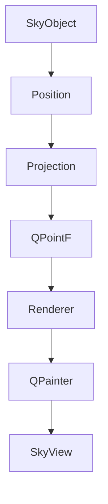
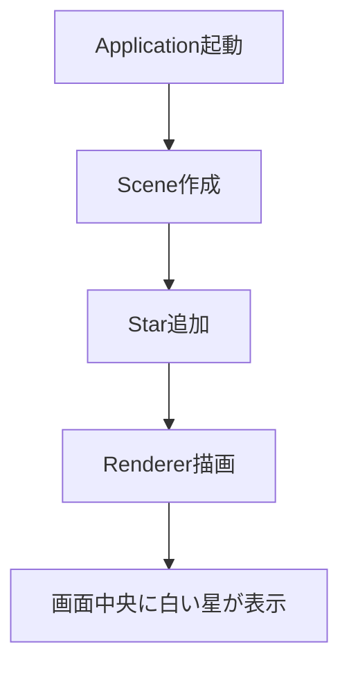
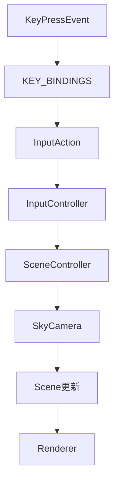
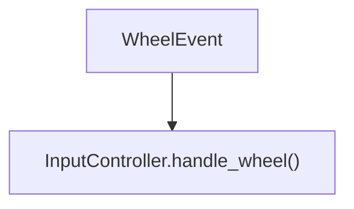
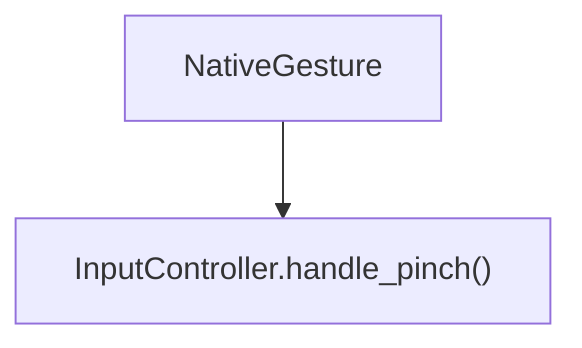
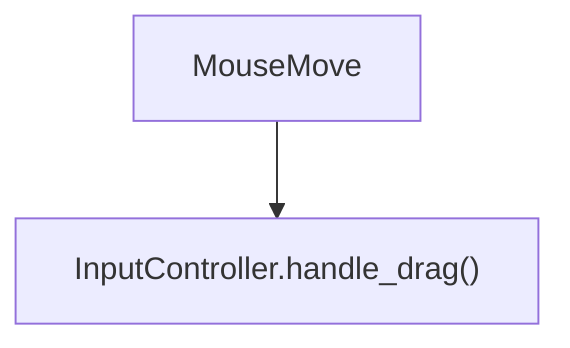
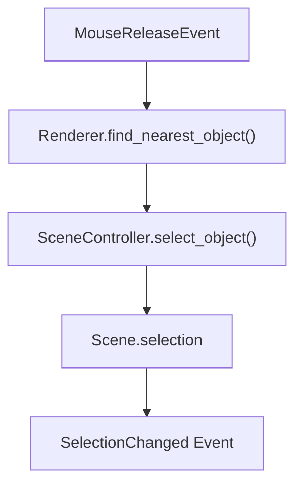
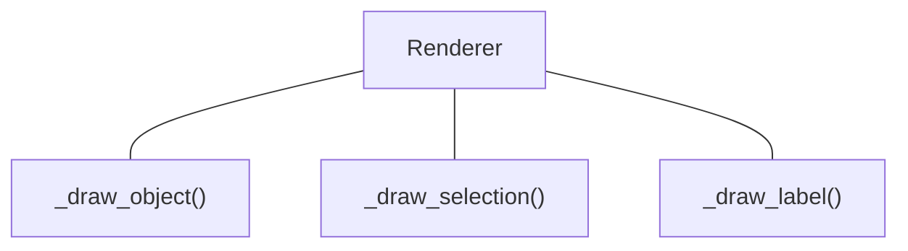
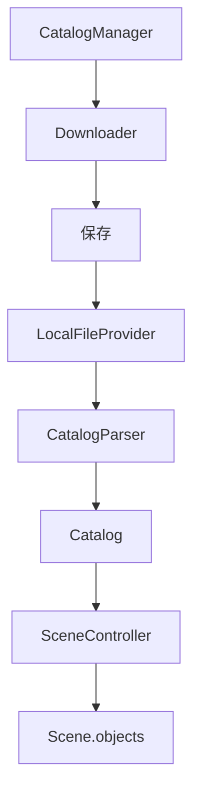
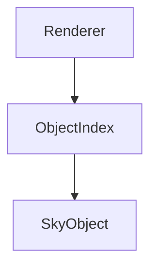

# 結合ファイル構成案内

このファイルは以下の順序で結合されています：

1. `docs/implementation/03_first_rendering.md`
2. `docs/implementation/04_camera_control.md`
3. `docs/implementation/05_selection.md`
4. `docs/implementation/06_catalog.md`
5. `docs/implementation/07_object_index.md`
6. `docs/implementation/08_rendering_settings.md`
7. `docs/implementation/09_projection_grid_coordinates.md`
8. `docs/implementation/10_dynamic_objects_and_catalogs.md`

---


--- 
## ファイル名: `docs/implementation/03_first_rendering.md`
---

# First Rendering

> この章は初期描画を実装した時点の記録である。2026年8月12日時点の実装状況と次の計画は `10_dynamic_objects_and_catalogs.md` を参照する。

## 1. 目的
SceneからSkyObjectを取得し、Projectionを経由してRendererがSkyViewへ描画できることを確認する。
初期実装では LinearProjection を採用する。これは開発・デバッグを容易にするための単純な線形投影であり、将来的に OrthographicProjection などの球面投影へ置き換えることを前提とする。

## 2. 完成した機能
- Scene
- SceneController
- SkyObject
- Star
- Position
- Magnitude
- SkyCamera
- Projection
- LinearProjection
- Renderer
- SkyView


## 3. 描画パイプライン


```mermaid
flowchart TD
A[SkyObject] --> B[Position];
B --> C[Projection];
C --> D[QPointF];
D --> E[Renderer];
E --> F[QPainter];
F --> G[SkyView];
```


## 4. 実装内容
### Scene
現在の空の状態を保持するデータクラス。

#### 責務
- Time
- Observer
- SkyCamera
- SKyObject
- LayerManager
- Selection
- Focus
の管理

#### 責務ではないこと
- データ変更
- イベント発行
- 描画


### SceneController
Sceneを書き換える唯一の窓口。

#### 責務
- Sceneの状態を書き換える
- EventBusへイベントを発行する
- GUIやRendererから直接Sceneを書き換えさせない

#### 現在のメソッド
- ``__init__(self, scene: Scene, event_bus: EventBus):``
- ``scene(self) -> Scene (getter)``
- ``set_time(self, time: Time) -> None``
- ``set_observer(self, observer: Observer) -> None``
- ``add_object(self, sky_object: SkyObject) -> None``
- ``remove_object(self, sky_object: SkyObject) -> None``
- ``select_object(self, sky_object: SkyObject) -> None``
- ``clear_selection(self) -> None``
- ``set_focus(self, sky_object: SkyObject) -> None``
- ``clear_focus(self) -> None``

#### 責務ではないこと
- 描画
- 座標計算
- 天体位置計算
- GUI操作

### Renderer

Sceneを画面へ描画する。

#### 責務
- Sceneを読み取る
- Projectionへ座標変換を依頼する
- QPainterへ描画命令を送る
- 現時点では、``_draw_background()``, ``_draw_objects()``のみ実装

#### 責務ではないこと
- Sceneの変更
- 座標計算
- SkyObjectの更新

### Projection
天球座標を画面座標へ変換する。

入力
- Position
- SkyCamera
- Viewportサイズ

出力
- QPointF
- 画面外の場合はNone

責務ではないこと
- 描画
- 天体計算

### SkyObject

表示対象となる天体の基底クラス。

保持する情報
- id
- name
- object_type
- position
- magnitude

初期実装時点では固定天体のみを想定していた。

現在は共通インターフェースとして `get_position(time, observer)` と `get_magnitude(time, observer)` が用意され、ISS・惑星・月などの動的天体を実装できる。ただし、利用側から時刻・観測地点を渡す処理は未完成である。

## 5. 決定事項
- Positionは内部ではRA/Dec管理、必要に応じて他の座標系へ変換
- Magnitudeはfloatではなく、Magnitudeクラスで管理
- Eventは以下を使用
```
TIME_CHANGED
OBSERVER_CHANGED
OBJECT_ADDED
OBJECT_REMOVED
SELECTION_CHANGED
FOCUS_CHANGED
LAYER_CHANGED
CAMERA_CHANGED
MOUNT_CHANGED
```

- RendererはSkyObjectの具体的な描画処理を各 ``_draw_xxx()`` メソッドへ委譲する。``render()``・``_draw_objects()``・``_draw_object()`` の構造は今後も原則変更せず、新しいSkyObject型を追加する場合は対応する ``_draw_xxx()`` を追加することで拡張する。


## 6. 動作確認

```mermaid
flowchart TD
A[Application起動] --> B[Scene作成];
B --> C[Star追加];
C --> D[Renderer描画];
D --> E[画面中央に白い星が表示];
```

## 7. 設計思想
- Sceneはデータのみ保持する
- SceneControllerのみSceneを書き換える
- RendererはSceneを変更しない
- Projectionは座標変換のみ担当する
- GUIはRendererへ描画を依頼するだけ

## 8. 初期実装時点の制約

- Projectionは中心座標のみ対応していた
- Starのみ描画確認済みだった
- 星表は未実装だった
- Camera移動は未実装だった

これらの多くは後続実装で解消され、現在は StereographicProjection、HYG、カメラ移動、Layer描画などに対応している。

## 9. 当時の次の実装予定

- Projectionの本実装
- RA/Dec→画面座標
- Camera移動
- マウスドラッグ
- Layer描画

上記は後続章で実装済みである。


--- 
## ファイル名: `docs/implementation/04_camera_control.md`
---

# Camera Control

## 1. 目的
ユーザーが視点を自由に移動・拡大縮小できるようにする。
描画系(Renderer)と入力系(Input)を分離する。

## 2. 前提
03 First Rendering
Scene
SkyCamera
Projection

## 3. 完成した機能
- ```SkyCamera.move()```
- ```SkyCamera.zoom()```
- ```Position.moved()```
- ```Position.normalized()```
- ```SceneController.move_camera()```
- ```SceneController.zoom_camera()```
- ```InputController```
- ```InputAction```
- ```KEY_BINDINGS```
- ```SkyView.keyPressEvent()```
- ```SkyView.wheelEvent()```
- ```SkyView.mousePressEvent()```
- ```SkyView.mouseMoveEvent()```
- ```SkyView.mouseReleaseEvent()```
- ```SkyView.event()``` (NativeGesture)
Macトラックパッドのピンチズーム
マウスドラッグによる視点移動

## 4. 実装したクラス
### ```Position```

#### 追加

- ```moved()```
- ```normalized()```

#### 役割

座標操作を担当する。


### ```SkyCamera```

#### 追加

- ```move()```
- ```zoom()```
- ```project()```

#### 役割

カメラ状態を保持する。
Projectionへ変換処理を委譲する。
SceneController

#### 追加

- ```move_camera()```
- ```zoom_camera()```

#### 役割

Sceneを書き換える唯一の窓口。
InputController

#### 追加

- ```handle_action()```
- ```handle_wheel()```
- ```handle_pinch()```
- ```handle_drag()```

#### 役割

入力をScene操作へ変換する。
### ```InputAction```

#### 役割

入力操作の列挙。

例
- ```MOVE_UP```
- ```MOVE_DOWN```
- ```MOVE_LEFT```
- ```MOVE_RIGHT```
- ```ZOOM_IN```
- ```ZOOM_OUT```
- ```ROTATE_LEFT```
- ```ROTATE_RIGHT```
- ```RESET_CAMERA```
- ```KEY_BINDINGS```

### 役割

キー入力とInputActionを対応付ける。

SkyView

### 追加

- ```keyPressEvent()```
- ```wheelEvent()```
- ```mousePressEvent()```
- ```mouseMoveEvent()```
- ```mouseReleaseEvent()```
- ```event()```

### 役割

QtイベントをInputControllerへ渡す。


## 5. 処理の流れ
キー入力


```mermaid
flowchart TD

A[KeyPressEvent] --> B[KEY_BINDINGS]
B --> C[InputAction]
C --> D[InputController]
D --> E[SceneController]
E --> F[SkyCamera]
F --> G[Scene更新]
G --> H[Renderer]
```

ホイール

```mermaid
flowchart TD

A[WheelEvent] --> B["InputController.handle_wheel()"]
```

ピンチ

```mermaid
flowchart TD

A[NativeGesture] --> B["InputController.handle_pinch()"]
```


ドラッグ

```mermaid
flowchart TD

A[MouseMove] --> B["InputController.handle_drag()"]
```

## 6. 設計判断
### 採用した設計
- InputControllerを導入し、GUIとSceneControllerを直接結び付けない。
- SkyCameraがProjectionを保持する。
- SkyCamera.project()でProjectionへ委譲する。
- Position自身が移動・正規化を行う。

### 採用しなかった設計
- RendererからProjectionを直接呼び出す。
- SkyViewからSceneControllerを直接操作する。

### 理由
責務を分離し、Projectionや入力方式を変更しても他のクラスへの影響を最小限にするため。


## 7. 変更したファイル

ここには実際に変更したファイルを列挙します。

例

- ``camera/sky_camera.py``
- ``sky/position.py``
- ``scene/scene_controller.py``
- ``input/input_controller.py``
- ``input/input_action.py``
- ``input/key_bindings.py``
- ``gui/sky_view.py``
- ``event/event_type.py``

## 8. TODO
- カメラ回転
- 慣性スクロール
- ドラッグ方向の設定
- タッチ操作の追加

## 9. この実装で得られたこと
- カメラを自由に操作できるようになった。
- 入力方式を追加しやすい構造になった。
- GUIとSceneの責務を分離できた。

## 10. 次に実装するもの
- Object Selection
- Label表示
- Catalog System


--- 
## ファイル名: `docs/implementation/05_selection.md`
---

# Selection

## 1. 目的
- 描画された天体をマウスで選択できるようにする。
- 選択された天体を Scene に保持し、他の機能から利用できるようにする。

## 2. 前提
- 03 First Rendering
- 04 Camera Control

## 3. 完成した機能
- ``Scene.selection``
- ``SceneController.select_object()``
- ``Renderer._find_nearest_object()``
- ``Renderer._draw_selection()``
- ``Renderer._draw_label()``
- ``SkyView.mouseReleaseEvent()``
- ``SelectionChanged Event``

## 4. 実装したクラス
### ``Selection``

#### 役割

現在選択されている天体を保持する。

#### 保持するもの

- `selected`
- `SceneController`

#### 追加

- `select_object()`

#### 役割

Selection を変更する唯一の窓口。

### ```Renderer```

#### 追加

- `_find_nearest_object()`
- `_draw_selection()`
- `_draw_label()`

#### 役割
- 選択対象の探索
- 選択マーカー描画
- ラベル描画
- SkyView

#### 追加
`mouseReleaseEvent()`

#### 役割

クリックされた座標から天体を選択する。

## 5. 処理の流れ
### 選択


```mermaid
flowchart TD

A[MouseReleaseEvent] --> B["Renderer.find_nearest_object()"]
B --> C["SceneController.select_object()"]
C --> D[Scene.selection]
D --> E[SelectionChanged Event]
```

### 描画


```mermaid
flowchart TD

A[Renderer]---B["_draw_object()"]
A---C["_draw_selection()"]
A---D["_draw_label()"]
```

## 6. 設計判断
### 採用した設計
- Selection は Scene が保持する。
- Renderer は選択状態を参照するだけにする。
- Selection は 1 個だけ保持する。
### 採用しなかった設計
- Renderer が選択状態を保持する。
- 複数選択を最初から実装する。
### 理由
Scene がアプリケーション全体の状態を管理するため。


## 7. 変更したファイル
例
- scene/selection.py
- scene/scene.py
- scene/scene_controller.py
- rendering/renderer.py
- gui/sky_view.py
- event/event_type.py

## 8. TODO
- 複数選択
- 選択優先順位
- ラベル表示条件
- Hover表示
- タッチ選択

## 9. この実装で得られたこと
- 任意の天体をクリックして選択できるようになった。
- 選択状態を他機能から利用できるようになった。
- ラベル表示の基礎が完成した。

## 10. 次に実装するもの
Catalog System


--- 
## ファイル名: `docs/implementation/06_catalog.md`
---

# Catalog


## 1. 目的
- 外部カタログを読み込み、Sceneへ登録できる仕組みを作る。
- Catalog の種類を増やしても既存コードを変更しなくて済む設計にする。

## 2. 前提
- 03 First Rendering
- 04 Camera Control
- 05 Selection

## 3. 完成した機能
- `Catalog`
- `CatalogManager`
- `CatalogProvider`
- `LocalFileProvider`
- `CatalogParser`
- `SceneController.load_catalog()`
- `Downloader`

## 4. 実装したクラス
### `Catalog`

#### 役割
`SkyObject` の集合を表す。
#### 保持するもの
`name`
`objects`


### `CatalogProvider`
#### 役割
`Catalog` を取得する共通インターフェース。


### `LocalFileProvider`
#### 役割
ローカルファイルから `Catalog` を生成する。

### `CatalogParser`
#### 役割
ファイル形式を `Catalog` へ変換する。

### `CatalogManager`
#### 役割
`Catalog` の取得・保存を管理する。

### `Downloader`
#### 役割
ネットワークからファイルを取得する。

### `SceneController`
#### 追加
- `load_catalog()`

#### 役割
`Catalog` の内容を `Scene` へ追加する。

## 5. 処理の流れ
読み込み

```mermaid
flowchart TD
A[CatalogManager] --> B[Downloader]
B --> C[保存]
C --> D[LocalFileProvider]
D --> E[CatalogParser]
E --> F[Catalog]
F --> G[SceneController]
G --> H[Scene.objects]
```


## 6. 設計判断
### 採用した設計
- `Provider` と `Parser` を分離する。
- `CatalogManager` がダウンロードを担当する。
- `Catalog` は `SkyObject` の集合のみを保持する。
### 採用しなかった設計
- `Provider` が `Parser` を兼ねる。
- `Parser` がファイルを開く。
- `Catalog` がファイルパスを保持する。
### 理由
責務を分離し、新しい形式や取得方法を容易に追加できるようにするため。


## 7. 変更したファイル
例
- catalog/catalog.py
- catalog/catalog_manager.py
- catalog/provider/catalog_provider.py
- catalog/provider/local_file_provider.py
- catalog/parser/catalog_parser.py
- network/downloader.py
- scene/scene_controller.py

## 8. TODO
- ネットワーク更新日時と有効期限の管理
- 更新失敗時に最後の正常データを残す処理
- 人工衛星用の手動更新と最低更新間隔
- `Catalog` の有効・無効
- `Catalog` ごとの Layer
- `Catalog` の読み込み進捗表示

## 9. この実装で得られたこと
- `Catalog` の追加が容易になった。
- ファイル形式と取得方法を独立して拡張できるようになった。
- `Scene` に大量の `SkyObject` を読み込める基盤が完成した。

## 10. 次に実装するもの
ObjectIndex
HYG Catalog


--- 
## ファイル名: `docs/implementation/07_object_index.md`
---

# ObjectIndex

## 1. 目的

Scene に存在する SkyObject へ高速にアクセスするための基盤を実装する。

ObjectIndex は検索・取得専用のクラスとし、
SkyObject の生成・削除や描画などの責務は持たない。

Renderer、検索機能、Object Browser などは ObjectIndex を利用して SkyObject を取得する。

Scene が保持する補助データ（ObjectIndexなど）は、必ず SceneController が同期を保証するようにする。

---

## 2. 前提

- 03 First Rendering
- 04 Camera Control
- 05 Selection
- 06 Catalog

---

## 3. 完成した機能

- `ObjectIndex`
- `Scene.object_index`
- `SceneController.update_object_index()`
- `ObjectIndex.update()`
- `ObjectIndex.find_by_id()`
- `ObjectIndex.find_by_name()`
- `ObjectIndex.find_by_type()`
- `ObjectIndex.find_visible_by_type()`

---

## 4. 実装したクラス

### `ObjectIndex`

#### 役割

Scene に存在する SkyObject へ高速にアクセスするためのインデックス。

ObjectIndex は Scene の内容を元に構築され、
SkyObject 自体は保持・管理しない。

#### 追加

- `update()`
- `find_by_id()`
- `find_by_name()`
- `find_by_type()`
- `find_visible_by_type()`

#### 責務

- Scene の SkyObject を検索する
- SkyObject を種類ごとに取得する
- 名前・IDによる検索
- 等級、赤経、赤緯による表示候補の絞り込み

#### 責務ではないこと

- SkyObject の生成
- SkyObject の削除
- Catalog の管理
- GUI一覧表示
- 描画
- Scene の変更

---

### `Scene`

#### 追加

- `object_index`

#### 役割

Scene に登録された SkyObject の検索用インデックスを保持する。

---

### `SceneController`

#### 追加

- `update_object_index()`

#### 役割

Scene の SkyObject が変更された際に、
ObjectIndex を更新する。

---

## 5. 処理の流れ

### Catalog読み込み

```mermaid
flowchart TD

A[CatalogManager]
-->B[Catalog]
-->C[SceneController]
-->D[Scene.objects]
-->E[ObjectIndex.update()]
```

### 名前検索

```mermaid
flowchart TD

A[Search]
-->B[ObjectIndex.find_by_name()]
-->C[SkyObject]
```

### Renderer


```mermaid
flowchart TD

A[Renderer]
-->B[ObjectIndex]
-->C[SkyObject]
```

---

## 6. 設計判断

### 採用した設計

- ObjectIndex は検索専用クラスとする。
- Scene が ObjectIndex を保持する。
- SceneController が ObjectIndex を更新する。
- ObjectIndex は Scene の SkyObject を元に構築する。

### 採用しなかった設計

- ObjectTree にする。
- GUI が Catalog を直接検索する。
- Renderer が SkyObject を線形探索する。
- ObjectIndex が SkyObject を所有する。

### 理由

責務を分離し、
検索方法を変更しても
Renderer や GUI を変更しなくて済むようにするため。

---

## 7. 変更したファイル

例

- `scene/scene.py`
- `scene/scene_controller.py`
- `scene/object_index.py`
- `rendering/renderer.py`
- `sky/object_type.py`

---

## 8. TODO

- `find_nearest()` の実装
- 別名と表記ゆれに対応した名前検索
- 固定天体用空間インデックスと動的天体の分離
- 動的天体の現在位置を使った選択処理
- 検索候補
- 部分一致検索
- 複数カタログ対応

---

## 9. この実装で得られたこと

- SkyObject の取得方法を統一できた。
- 検索機能の基盤が完成した。
- Renderer が検索方法を意識しなくてよくなった。
- 将来的な高速化を ObjectIndex のみで実現できる構造になった。

---

## 10. 次に実装するもの

- Rendering Settings
  - 等級による表示制限
  - 恒星サイズ
  - 恒星色


--- 
## ファイル名: `docs/implementation/08_rendering_settings.md`
---

# 08. Rendering Settings

## 1. 目的

描画設定を Scene に集約し、Renderer と Layer が同じ設定を参照できるようにする。

## 2. 完成した機能

- RenderingSettings
- 等級制限
- GridSettings
- 座標系グリッドごとの表示ON/OFF
- 座標系グリッドごとの色設定

## 3. 実装クラス

- RenderingSettings
- GridSettings
- ColorSettings

## 4. 処理

```text
Scene
    ↓
RenderingSettings
    ↓
Renderer
    ↓
Layer
```

## 5. 設計判断

描画設定をCameraから分離した。

GridSettings は RenderingSettings の一部として保持する。
これにより、赤道座標グリッド、方位高度座標グリッド、将来の銀河座標グリッドを同じ仕組みでON/OFFできる。

## 6. TODO

- 恒星サイズ
- 恒星色
- 星雲の描画設定
- ラベル設定


--- 
## ファイル名: `docs/implementation/09_projection_grid_coordinates.md`
---

# 09. Projection and Grid Coordinates

## 1. 目的

Projection を LinearProjection と HorizontalLinearProjection のどちらに切り替えても、座標系グリッドを描画できるようにする。

## 2. 問題

以前の GridLayer は、CoordinateGrid が返す座標型と Projection が受け取る座標型が常に一致すると仮定していた。

そのため、Application の ProjectionManager を LinearProjection に変更した状態で HorizontalGrid を描画すると、HorizontalGrid が `visible_bounds()` の戻り値を HorizontalPosition として扱い、実際には Position が返ってクラッシュしていた。

同じ構造のままでは、HorizontalLinearProjection で EquatorialGrid を描画する場合にも同種の問題が起きる。

## 3. 修正方針

GridLayer は座標変換を行わず、Projection へ委譲する。

CoordinateGrid は自分の座標系のグリッド線だけを生成する。
Projection はグリッド座標の座標系を受け取り、現在の投影方式に必要な座標へ変換してから画面座標へ投影する。

## 4. 実装

- `Projection.project_grid_position()` を追加した
- `LinearProjection` は HorizontalPosition を赤経赤緯へ変換して描画できるようにした
- `HorizontalLinearProjection` は Position を方位高度へ変換して描画できるようにした
- `CoordinateTransformer.horizontal_to_equatorial()` を追加した
- `EquatorialGrid` は SkyCamera の赤経赤緯中心と FOV から表示範囲を作るようにした
- `HorizontalGrid` は SkyCamera の中心を方位高度へ変換し、地平座標上の表示範囲を作るようにした
- `GridLayer` は EquatorialGrid と HorizontalGrid の両方を登録するようにした

## 5. 設計判断

Renderer と Layer は描画だけを担当する。

座標系の相互変換は CoordinateTransformer と Projection に閉じ込めた。
これにより、座標系グリッドは投影方式と独立して表示できる。

## 6. 確認

`tests/rendering/test_grid_layer_projection.py` を追加し、以下を確認した。

- LinearProjection で GridLayer が例外なく描画される
- HorizontalLinearProjection で GridLayer が例外なく描画される

現在の標準投影は `StereographicProjection` である。LinearProjection と HorizontalLinearProjection は開発・比較・回帰確認用として残す。


--- 
## ファイル名: `docs/implementation/10_dynamic_objects_and_catalogs.md`
---

# 10. Dynamic Objects and Additional Catalogs

## 1. 目的

太陽・月・惑星、ISS、Messier・NGC・ICを、現在の描画・検索・選択・架台導入へ安全に統合する。

2026年9月3日の資料提出までに、全種類を網羅することより、各系統を一つずつ操作可能な状態で完成させ、設計判断・精度・性能を記録することを優先する。

## 2. 2026年8月12日時点の実装状況

### 実装済み

- `StereographicProjection` を標準投影として使用
- HYG恒星カタログと星座線の読込み
- JPL DE440sのローカル保存とSkyfieldContextへの読込み
- ObjectIndexによる天体種別・等級・表示範囲の絞り込み
- ObjectLayer、LabelLayer、SelectionLayer、MountLayer
- 時刻変更、停止、等速、加減速
- E-ZEUS IIの接続、位置取得、導入、同期、停止、追尾

### 型・インターフェース実装済み（実データ未投入）

- `Planet`
- `Moon`
- `Satellite`
- `DeepSkyObject`
- `ObjectType.PLANET / MOON / SATELLITE / DSO`
- `SkyObject.get_position(time, observer)`
- `SkyObject.get_magnitude(time, observer)`

### 未完成

- 動的天体の位置・等級計算
- 全呼出し元から Time と Observer を渡す処理
- 惑星の描画処理
- 動的天体を固定座標用空間インデックスから除外する処理
- カタログの更新期限と失敗時フォールバック
- OpenNGCとISS軌道要素の読込み

## 3. 現在の問題

現在の ObjectIndex は `update()` 時に `obj.get_position()` と `obj.get_magnitude()` を引数なしで呼び、固定座標として赤緯ビンと等級順を構築する。この方式を太陽系天体や人工衛星へそのまま適用すると、未実装例外が発生するか、時刻変更後も古い位置で検索される。

また、Projection、LabelLayer、SelectionPanel、MainActionsなどにも引数なしの位置・等級取得が残っている。動的天体を追加する前に、この呼出し経路を修正する。

## 4. 採用する設計

### 固定天体

StarとDeepSkyObjectは、現在の等級・赤経・赤緯インデックスへ登録する。

### 動的天体

Planet、Moon、Satellite、Comet、Asteroidは固定座標用空間インデックスへ登録しない。初期実装ではObjectTypeごとのリストから列挙し、描画時点のTimeとObserverで位置・等級を得る。

太陽系天体は10個未満、ISSは当初1機なので、動的天体向けの高度な空間インデックスは作らない。

### キャッシュ

- 太陽・月・惑星: 約1秒
- ISS: 約0.05秒
- 観測地点変更: 全動的天体キャッシュを無効化
- 時刻の大幅変更・逆再生: 対応するキャッシュを無効化
- 軌道要素更新: Satelliteキャッシュを無効化

キャッシュのキーは少なくとも天体ID、丸めた時刻、観測地点、元データの版を含む。

## 5. 実装順

### Step 1: 動的天体共通処理

1. 固定天体か動的天体かを判別できる契約を追加する
2. ObjectIndexのID・名前・種別検索には両方を含め、空間・等級インデックスには固定天体だけを入れる
3. Projection、ObjectLayer、LabelLayer、SelectionPanel、MainActionsへSceneのTimeとObserverを渡す
4. 動的天体用キャッシュと無効化処理を追加する
5. 固定天体の描画時間が悪化していないことを測定する

完成条件:

- ダミー動的天体が時刻変更に合わせて移動する
- 選択、ラベル、中央移動、導入が同じ現在位置を使う
- HYG恒星表示に回帰がない

### Step 2: 太陽・月・惑星

1. DE440sとSkyfieldで観測地点から見た見かけの赤経赤緯を計算する
2. 地球を表示対象から除外し、太陽、月、水星から海王星までを登録する
3. 惑星の視等級を計算する
4. ObjectLayerへ太陽・月・惑星の最小描画を追加する
5. 選択パネルへ現在位置と等級を表示する

内部Positionは既存恒星と合わせるため、ICRF/J2000系との整合を保つ。表示用のDate座標と混同しない。

完成条件:

- 時間を進めると各天体が連続的に移動する
- 観測地点変更により月などの地心視差が反映される
- 既知のプラネタリウムまたはSkyfield計算値と位置を比較できる

### Step 3: ISS 1機

1. CelesTrakのOMM CSVを取得・保存する
2. Skyfieldの `EarthSatellite.from_omm()` で読込む
3. 観測地点から見たtopocentric位置を計算する
4. ISSを描画・選択し、RA/Dec、Alt/Az、距離、軌道要素元期を表示する
5. 数分先までの予想経路を描画する
6. 更新失敗時は最後に正常取得したデータを使用する

完成条件:

- ISSの現在方向と予想経路が時刻変更に追従する
- 軌道要素が古い場合に警告を表示する
- オフラインでも保存済みデータで起動できる

この段階では架台追尾へ接続しない。表示位置と時刻処理の正しさを確認した後に行う。

### Step 4: Messier・NGC・IC

1. OpenNGCの `NGC.csv` と `addendum.csv` を取得する
2. OpenNGCParserでDeepSkyObjectへ変換する
3. 正規IDとaliasesを保持する
4. `M31`、`M 31`、`NGC224`、`NGC 224`などを正規化して同一天体へ解決する
5. 銀河、散開星団、球状星団、星雲を簡単な記号で描き分ける

M40、M45などNGC/IC番号を持たない対象も扱うため、`addendum.csv`を必ず読む。同一天体のカタログ名を別オブジェクトとして重複登録しない。

完成条件:

- Messier、NGC、ICの代表天体を複数表記で検索できる
- 選択・中央移動・固定天体導入ができる
- 追加前後の天体数、ObjectIndex構築時間、1フレーム描画時間を記録する

### Step 5: 実機確認とISS追尾

1. E-ZEUS IIで恒星・惑星の導入方向を確認する
2. MountLayerの表示と実機方向を比較する
3. ISSの予測位置、更新周期、通信周期を測定する
4. 安全な停止処理を確認してから連続追尾へ接続する

## 6. データ更新方針

| データ | 標準形式 | 更新方針 |
|---|---|---|
| HYG・OpenNGC | CSV | 手動または版変更時 |
| DE440s | BSP | 通常は再取得しない |
| ISS | OMM CSV | 2時間未満では再取得せず、自動・手動更新 |

ファイルが存在するだけで更新不要とは判断しない。CatalogInfoまたは別のメタデータに取得日時、元データの版、更新期限を保持する。ダウンロードは一時ファイルへ行い、解析成功後にのみ前回ファイルと置き換える。

## 7. テスト

- 固定天体だけが空間インデックスへ入る
- 動的天体もID・名前・種別で検索できる
- 時刻・観測地点の変更で動的位置が変わる
- キャッシュ範囲内では再計算されず、無効化条件では再計算される
- OMM取得失敗時に正常な旧データが残る
- OpenNGCのaliasesが同一天体を返す
- M40、M45を検索できる
- 固定天体の描画性能に大きな回帰がない

## 8. 提出資料として残すもの

- 機能追加前後のクラス図またはデータフロー図
- 固定天体と動的天体を分離した理由
- 惑星位置を他ソフトと比較した表
- ISSの予想経路と実際の通過を比較したスクリーンショットまたは動画
- OpenNGC追加前後の天体数、起動時間、ObjectIndex構築時間、1フレーム時間
- オフライン時に前回データで動作する様子
- E-ZEUS II実機の方向とMountLayer表示の比較
- 失敗と修正内容を含むGitコミット・Issue・テスト結果

## 9. 今回は後回しにするもの

- 全活動衛星・Starlink全機の常時表示
- 精密なDSO輪郭・テクスチャ
- 惑星表面の写実描画
- 一般化したプラグイン機構
- ISS以外の人工衛星追尾
- Plate Solveとカメラ自動撮影の統合

## 10. 参考資料

- AstroNavigator `develop`: https://github.com/oi-so/AstroNavigator/tree/develop
- Skyfield Earth Satellites: https://rhodesmill.org/skyfield/earth-satellites.html
- CelesTrak GP Data Formats: https://celestrak.org/NORAD/documentation/gp-data-formats.php
- CelesTrak Usage Policy: https://celestrak.org/usage-policy.php
- OpenNGC: https://github.com/mattiaverga/OpenNGC

OpenNGCはCC BY-SA 4.0で公開されているため、配布時はライセンス表示と帰属を含める。
