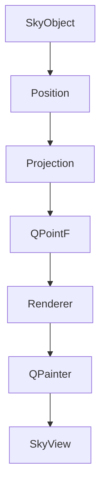
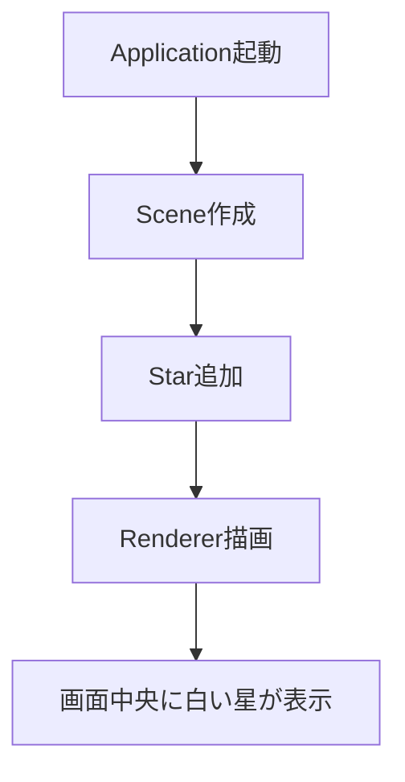

# First Rendering

## 1. 目的
SceneからSkyObjectを取得し、Projectionを経由してRendererがSkyViewへ描画できることを確認する。


## 2. 完成した機能
- Scene
- SceneController
- SkyObject
- Star
- Position
- Magnitude
- SkyCamera
- Projection
- OrthographicProjection
- Renderer
- SkyView


## 3. 描画パイプライン




## 4. 実装内容
### Scene
現在の空の状態を保持するデータクラス。

#### 責務
- Time
- Observer
- SkyCamera
- SKyObject
- LayerManager
- Selection
- Focus
の管理

#### 責務ではないこと
- データ変更
- イベント発行
- 描画


### SceneController
Sceneを書き換える唯一の窓口。

#### 責務
- Sceneの状態を書き換える
- EventBusへイベントを発行する
- GUIやRendererから直接Sceneを書き換えさせない

#### 現在のメソッド
- ``__init__(self, scene: Scene, event_bus: EventBus):``
- ``scene(self) -> Scene (getter)``
- ``set_time(self, time: Time) -> None``
- ``set_observer(self, observer: Observer) -> None``
- ``add_object(self, sky_object: SkyObject) -> None``
- ``remove_object(self, sky_object: SkyObject) -> None``
- ``select_object(self, sky_object: SkyObject) -> None``
- ``clear_selection(self) -> None``
- ``set_focus(self, sky_object: SkyObject) -> None``
- ``clear_focus(self) -> None``

#### 責務ではないこと
- 描画
- 座標計算
- 天体位置計算
- GUI操作

### Renderer

Sceneを画面へ描画する。

#### 責務
- Sceneを読み取る
- Projectionへ座標変換を依頼する
- QPainterへ描画命令を送る
- 現時点では、``_draw_background()``, ``_draw_objects()``のみ実装

#### 責務ではないこと
- Sceneの変更
- 座標計算
- SkyObjectの更新

### Projection
天球座標を画面座標へ変換する。

入力
- Position
- SkyCamera
- Viewportサイズ

出力
- QPointF
- 画面外の場合はNone

責務ではないこと
- 描画
- 天体計算

### SkyObject

表示対象となる天体の基底クラス。

保持する情報
- id
- name
- object_type
- position
- magnitude

現在は固定天体のみ想定している。

将来的には動的天体
(ISS・惑星・月など)
は別クラスへ分離する予定。

## 5. 決定事項
- Positionは内部ではRA/Dec管理、必要に応じて他の座標系へ変換
- Magnitudeはfloatではなく、Magnitudeクラスで管理
- Eventは以下を使用
```
TIME_CHANGED
OBSERVER_CHANGED
OBJECT_ADDED
OBJECT_REMOVED
SELECTION_CHANGED
FOCUS_CHANGED
LAYER_CHANGED
CAMERA_CHANGED
MOUNT_CHANGED
```

- RendererはSkyObjectの具体的な描画処理を各 ``_draw_xxx()`` メソッドへ委譲する。``render()``・``_draw_objects()``・``_draw_object()`` の構造は今後も原則変更せず、新しいSkyObject型を追加する場合は対応する ``_draw_xxx()`` を追加することで拡張する。


## 6. 動作確認


## 7. 設計思想
- Sceneはデータのみ保持する
- SceneControllerのみSceneを書き換える
- RendererはSceneを変更しない
- Projectionは座標変換のみ担当する
- GUIはRendererへ描画を依頼するだけ

## 8. 現在の制約
- Projectionは中心座標のみ対応
- OrthographicProjectionのみ存在
- Starのみ描画確認済み
- 星表は未実装
- Camera移動は未実装

## 9. 次の実装予定
- Projectionの本実装
- RA/Dec→画面座標
- Camera移動
- マウスドラッグ
- Layer描画