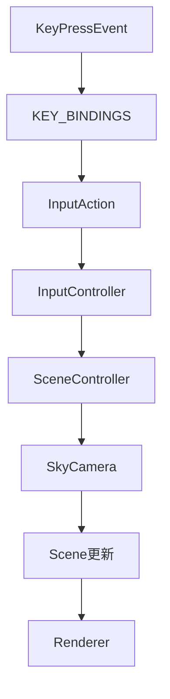
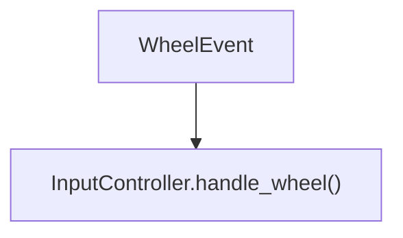
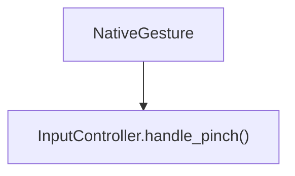
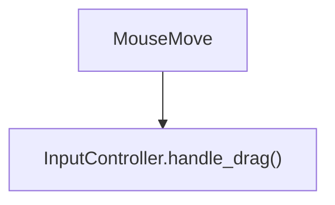

# Camera Control

## 1. 目的
ユーザーが視点を自由に移動・拡大縮小できるようにする。
描画系(Renderer)と入力系(Input)を分離する。

## 2. 前提
03 First Rendering
Scene
SkyCamera
Projection

## 3. 完成した機能
- ```SkyCamera.move()```
- ```SkyCamera.zoom()```
- ```Position.moved()```
- ```Position.normalized()```
- ```SceneController.move_camera()```
- ```SceneController.zoom_camera()```
- ```InputController```
- ```InputAction```
- ```KEY_BINDINGS```
- ```SkyView.keyPressEvent()```
- ```SkyView.wheelEvent()```
- ```SkyView.mousePressEvent()```
- ```SkyView.mouseMoveEvent()```
- ```SkyView.mouseReleaseEvent()```
- ```SkyView.event()``` (NativeGesture)
Macトラックパッドのピンチズーム
マウスドラッグによる視点移動

## 4. 実装したクラス
### ```Position```

#### 追加

- ```moved()```
- ```normalized()```

#### 役割

座標操作を担当する。


### ```SkyCamera```

#### 追加

- ```move()```
- ```zoom()```
- ```project()```

#### 役割

カメラ状態を保持する。
Projectionへ変換処理を委譲する。
SceneController

#### 追加

- ```move_camera()```
- ```zoom_camera()```

#### 役割

Sceneを書き換える唯一の窓口。
InputController

#### 追加

- ```handle_action()```
- ```handle_wheel()```
- ```handle_pinch()```
- ```handle_drag()```

#### 役割

入力をScene操作へ変換する。
### ```InputAction```

#### 役割

入力操作の列挙。

例
- ```MOVE_UP```
- ```MOVE_DOWN```
- ```MOVE_LEFT```
- ```MOVE_RIGHT```
- ```ZOOM_IN```
- ```ZOOM_OUT```
- ```ROTATE_LEFT```
- ```ROTATE_RIGHT```
- ```RESET_CAMERA```
- ```KEY_BINDINGS```

### 役割

キー入力とInputActionを対応付ける。

SkyView

### 追加

- ```keyPressEvent()```
- ```wheelEvent()```
- ```mousePressEvent()```
- ```mouseMoveEvent()```
- ```mouseReleaseEvent()```
- ```event()```

### 役割

QtイベントをInputControllerへ渡す。


## 5. 処理の流れ
キー入力



ホイール


ピンチ



ドラッグ


## 6. 設計判断
### 採用した設計
- InputControllerを導入し、GUIとSceneControllerを直接結び付けない。
- SkyCameraがProjectionを保持する。
- SkyCamera.project()でProjectionへ委譲する。
- Position自身が移動・正規化を行う。

### 採用しなかった設計
- RendererからProjectionを直接呼び出す。
- SkyViewからSceneControllerを直接操作する。

### 理由
責務を分離し、Projectionや入力方式を変更しても他のクラスへの影響を最小限にするため。


## 7. 変更したファイル

ここには実際に変更したファイルを列挙します。

例

- ``camera/sky_camera.py``
- ``sky/position.py``
- ``scene/scene_controller.py``
- ``input/input_controller.py``
- ``input/input_action.py``
- ``input/key_bindings.py``
- ``gui/sky_view.py``
- ``event/event_type.py``

## 8. TODO
- カメラ回転
- 慣性スクロール
- ドラッグ方向の設定
- タッチ操作の追加

## 9. この実装で得られたこと
- カメラを自由に操作できるようになった。
- 入力方式を追加しやすい構造になった。
- GUIとSceneの責務を分離できた。

## 10. 次に実装するもの
- Object Selection
- Label表示
- Catalog System