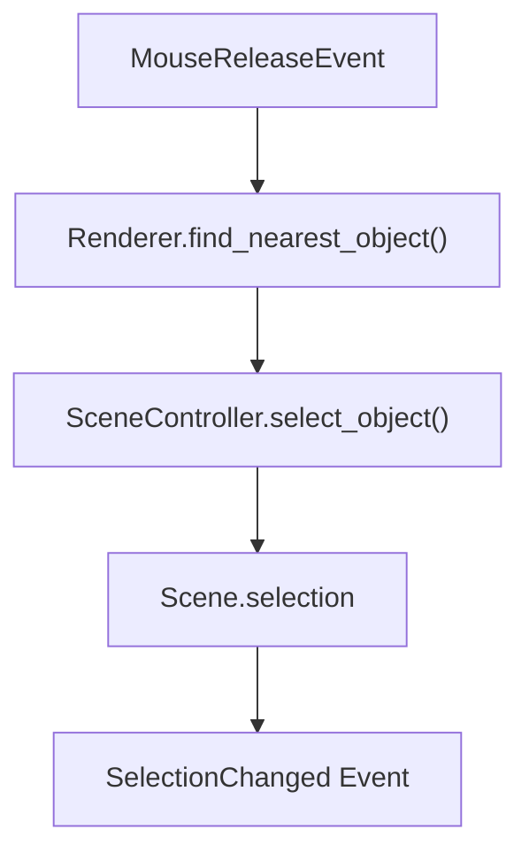
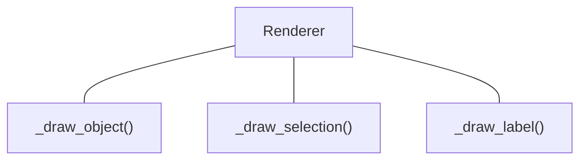

# Selection

## 1. 目的
- 描画された天体をマウスで選択できるようにする。
- 選択された天体を Scene に保持し、他の機能から利用できるようにする。

## 2. 前提
- 03 First Rendering
- 04 Camera Control

## 3. 完成した機能
- ``Scene.selection``
- ``SceneController.select_object()``
- ``Renderer._find_nearest_object()``
- ``Renderer._draw_selection()``
- ``Renderer._draw_label()``
- ``SkyView.mouseReleaseEvent()``
- ``SelectionChanged Event``

## 4. 実装したクラス
### ``Selection``

#### 役割

現在選択されている天体を保持する。

#### 保持するもの

- `selected`
- `SceneController`

#### 追加

- `select_object()`

#### 役割

Selection を変更する唯一の窓口。

### ```Renderer```

#### 追加

- `_find_nearest_object()`
- `_draw_selection()`
- `_draw_label()`

#### 役割
- 選択対象の探索
- 選択マーカー描画
- ラベル描画
- SkyView

#### 追加
`mouseReleaseEvent()`

#### 役割

クリックされた座標から天体を選択する。

## 5. 処理の流れ
### 選択



### 描画



## 6. 設計判断
### 採用した設計
- Selection は Scene が保持する。
- Renderer は選択状態を参照するだけにする。
- Selection は 1 個だけ保持する。
### 採用しなかった設計
- Renderer が選択状態を保持する。
- 複数選択を最初から実装する。
### 理由
Scene がアプリケーション全体の状態を管理するため。


## 7. 変更したファイル
例
- scene/selection.py
- scene/scene.py
- scene/scene_controller.py
- rendering/renderer.py
- gui/sky_view.py
- event/event_type.py

## 8. TODO
- 複数選択
- 選択優先順位
- ラベル表示条件
- Hover表示
- タッチ選択

## 9. この実装で得られたこと
- 任意の天体をクリックして選択できるようになった。
- 選択状態を他機能から利用できるようになった。
- ラベル表示の基礎が完成した。

## 10. 次に実装するもの
Catalog System