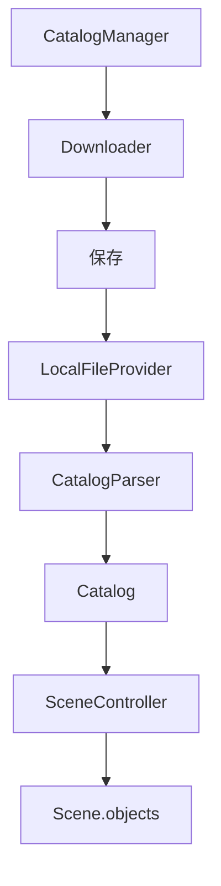

# Catalog

## 1. 目的
- 外部カタログを読み込み、Sceneへ登録できる仕組みを作る。
- Catalog の種類を増やしても既存コードを変更しなくて済む設計にする。

## 2. 前提
- 03 First Rendering
- 04 Camera Control
- 05 Selection

## 3. 完成した機能
- `Catalog`
- `CatalogManager`
- `CatalogProvider`
- `LocalFileProvider`
- `CatalogParser`
- `SceneController.load_catalog()`
- `Downloader`

## 4. 実装したクラス
### `Catalog`

#### 役割
`SkyObject` の集合を表す。
#### 保持するもの
`name`
`objects`

### `CatalogProvider`
#### 役割
`Catalog` を取得する共通インターフェース。

### `LocalFileProvider`
#### 役割
ローカルファイルから `Catalog` を生成する。

### `CatalogParser`
#### 役割
ファイル形式を `Catalog` へ変換する。

### `CatalogManager`
#### 役割
`Catalog` の取得・保存を管理する。

### `Downloader`
#### 役割
ネットワークからファイルを取得する。

### `SceneController`
#### 追加
- `load_catalog()`

#### 役割
`Catalog` の内容を `Scene` へ追加する。

## 5. 処理の流れ
読み込み

## 6. 設計判断
### 採用した設計
- `Provider` と `Parser` を分離する。
- `CatalogManager` がダウンロードを担当する。
- `Catalog` は `SkyObject` の集合のみを保持する。
### 採用しなかった設計
- `Provider` が `Parser` を兼ねる。
- `Parser` がファイルを開く。
- `Catalog` がファイルパスを保持する。
### 理由
責務を分離し、新しい形式や取得方法を容易に追加できるようにするため。

## 7. 変更したファイル
例
- catalog/catalog.py
- catalog/catalog_manager.py
- catalog/provider/catalog_provider.py
- catalog/provider/local_file_provider.py
- catalog/parser/catalog_parser.py
- network/downloader.py
- scene/scene_controller.py

## 8. TODO
- ネットワーク更新日時の管理
- キャッシュ
- `Catalog` の有効・無効
- `Catalog` ごとの Layer
- `Catalog` の読み込み進捗表示

## 9. この実装で得られたこと
- `Catalog` の追加が容易になった。
- ファイル形式と取得方法を独立して拡張できるようになった。
- `Scene` に大量の `SkyObject` を読み込める基盤が完成した。

## 10. 次に実装するもの
HYG Catalog
ObjectTree