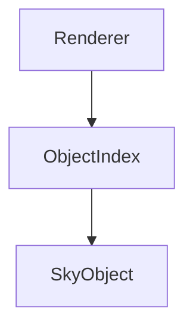

# ObjectIndex

## 1. 目的

Scene に存在する SkyObject へ高速にアクセスするための基盤を実装する。

ObjectIndex は検索・取得専用のクラスとし、
SkyObject の生成・削除や描画などの責務は持たない。

Renderer、検索機能、Object Browser などは ObjectIndex を利用して SkyObject を取得する。

---

## 2. 前提

- 03 First Rendering
- 04 Camera Control
- 05 Selection
- 06 Catalog

---

## 3. 完成した機能

- `ObjectIndex`
- `Scene.object_index`
- `SceneController.update_object_index()`
- `ObjectIndex.update()`
- `ObjectIndex.find_by_id()`
- `ObjectIndex.find_by_name()`
- `ObjectIndex.find_by_type()`
- `ObjectIndex.find_nearest()`

---

## 4. 実装したクラス

### `ObjectIndex`

#### 役割

Scene に存在する SkyObject へ高速にアクセスするためのインデックス。

ObjectIndex は Scene の内容を元に構築され、
SkyObject 自体は保持・管理しない。

#### 追加

- `update()`
- `find_by_id()`
- `find_by_name()`
- `find_by_type()`
- `find_nearest()`

#### 責務

- Scene の SkyObject を検索する
- SkyObject を種類ごとに取得する
- 名前・IDによる検索
- 最も近い SkyObject の検索

#### 責務ではないこと

- SkyObject の生成
- SkyObject の削除
- Catalog の管理
- GUI一覧表示
- 描画
- Scene の変更

---

### `Scene`

#### 追加

- `object_index`

#### 役割

Scene に登録された SkyObject の検索用インデックスを保持する。

---

### `SceneController`

#### 追加

- `update_object_index()`

#### 役割

Scene の SkyObject が変更された際に、
ObjectIndex を更新する。

---

## 5. 処理の流れ

### Catalog読み込み

```mermaid
flowchart TD

A[CatalogManager]
-->B[Catalog]
-->C[SceneController]
-->D[Scene.objects]
-->E[ObjectIndex.update()]
```

### 名前検索

```mermaid
flowchart TD

A[Search]
-->B[ObjectIndex.find_by_name()]
-->C[SkyObject]
```

### Renderer



---

## 6. 設計判断

### 採用した設計

- ObjectIndex は検索専用クラスとする。
- Scene が ObjectIndex を保持する。
- SceneController が ObjectIndex を更新する。
- ObjectIndex は Scene の SkyObject を元に構築する。

### 採用しなかった設計

- ObjectTree にする。
- GUI が Catalog を直接検索する。
- Renderer が SkyObject を線形探索する。
- ObjectIndex が SkyObject を所有する。

### 理由

責務を分離し、
検索方法を変更しても
Renderer や GUI を変更しなくて済むようにするため。

---

## 7. 変更したファイル

例

- `scene/scene.py`
- `scene/scene_controller.py`
- `scene/object_index.py`
- `rendering/renderer.py`
- `sky/object_type.py`

---

## 8. TODO

- 名前検索の高速化
- ID検索の高速化
- 空間インデックス
- 検索候補
- 部分一致検索
- 複数カタログ対応

---

## 9. この実装で得られたこと

- SkyObject の取得方法を統一できた。
- 検索機能の基盤が完成した。
- Renderer が検索方法を意識しなくてよくなった。
- 将来的な高速化を ObjectIndex のみで実現できる構造になった。

---

## 10. 次に実装するもの

- Rendering Settings
  - 等級による表示制限
  - 恒星サイズ
  - 恒星色