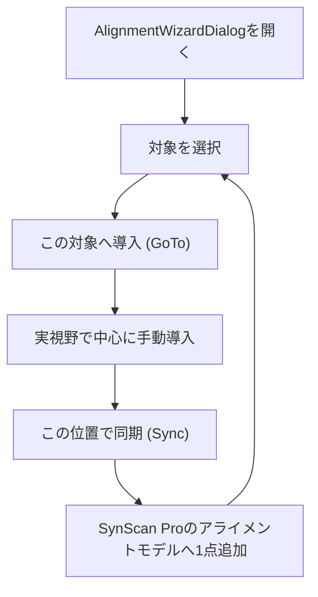
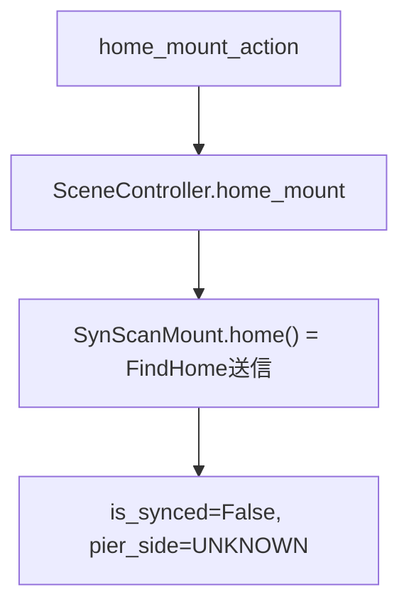
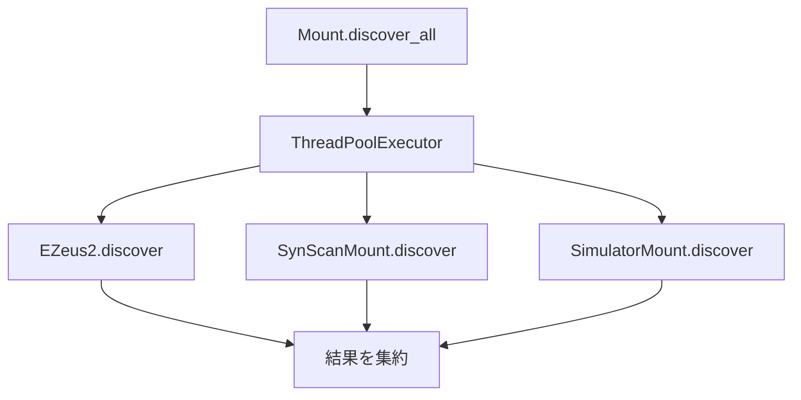

# 11. SynScan Mount 修正・追加実装

## 1. 目的

feature/synscanブランチで実機接続を確認した際に見つかった以下5点の問題を修正する。

- SynScan Pro経由の同期(Sync)が実質的に機能しない
- アライメント時にホームポジションへ移動する機能が使えない
- 接続可能デバイス一覧の取得に時間がかかる
- 子午線反転の扱いが不明確
- 動的天体追尾モードが存在しない

あわせて、SynScan Proの「Align with Sync」機能を利用したアライメント支援ウィザードをGUIへ追加する。

## 2. 前提

- 03 First Rendering
- 04 Camera Control
- 07 ObjectIndex
- E-ZEUS IIの既存Mount実装（設計比較の基準として参照）

## 3. SynScan App Protocolの調査結果

SynScan App ProtocolはASCOM ITelescopeV3相当のコマンド群をTCP/UDP経由で提供するが、以下の制約がある。

- **アライメント専用のコマンドは存在しない。** `SyncToCoordinates`（ASCOM Sync相当）を送ることが、アライメント星の追加操作を兼ねる。
- SynScan Pro側で「Alignment > Align with Sync」メニューを開いている間に受けた`SyncToCoordinates`は、アライメント星の追加として扱われる。開いていない状態で受けると、既存モデルへの補正サンプル追加という別の意味になる。この判断はSynScan Pro側の状態に依存し、ASCOM越しには判別も強制もできない。
- アライメントモデル（各アライメント星のsync点）は**SynScan Proアプリ内部にのみ**保持され、架台本体にもASCOM越しにも、個々の点へアクセスする手段は提供されていない。したがって個別のアライメント星を後から選んで削除するAPIは存在しない。
- 「Interactively confirm SyncTo」設定が有効な場合、既存モデルが24時間以上古いとSynScan Pro側で確認ポップアップが表示され、ユーザーがタップするまで`SyncToCoordinates`への応答が返らない。
- 導入(`SlewToCoordinatesAsync`)には、架台姿勢(pier_side)を明示指定するパラメータが存在しない。子午線反転の要否はSynScan Pro側が現在時刻と座標から自動的に判断する。
- `CanSetPierSideGet`（ASCOM `CanSetPierSide`）は「`SideOfPier`を強制的に書き換えて反転させられるか」を意味し、「GoTo時に反転先を指定できるか」とは別の概念である。

## 4. 完成した機能

- `Mount.discover_all()` の並列化
- `Mount.home()` / `Mount.can_home` の共通API化
- `Mount.supports_goto_pier_side`（新設）
- `SynScanMount.is_synced`（sync成否の追跡）
- `SynScanMount.sync()` のエラーメッセージ改善
- `SynScanMount.slew_to()` のpier_side引数の扱い修正
- `SynScanMount.home()` によるホームポジション移動と同期状態リセット
- `SynScanTrackingBackend`（動的天体追尾）
- `AlignmentWizardDialog`（GUIのアライメント支援ウィザード）

## 5. 実装したクラス・変更点

### `Mount`（抽象クラス、`mount/mount.py`）

#### 追加

- `can_home` (property, デフォルト `False`)
- `home()` （デフォルトは`NotImplementedError`。機構的なホームポジションを持つ架台のみオーバーライドする）
- `supports_goto_pier_side` (property, デフォルト `False`)

#### 変更

- `discover_all()` を `concurrent.futures.ThreadPoolExecutor` で並列実行するよう変更。各サブクラスの `discover()` は独立した処理のため、直列実行していた分の待ち時間を、最も遅いドライバ1つ分まで短縮する。

#### 役割

- `supports_goto_pier_side` は `can_set_pier_side`（ASCOM CanSetPierSide＝SideOfPierを強制的に書き換えられるか）とは異なる概念であることに注意。GoToコマンド自体に架台姿勢を含めて指定できるプロトコル/実装だけが `True` を返す。

### `EZeus2`（`mount/e_zeus/e_zeus2.py`）

#### 追加

- `supports_goto_pier_side` → `True`

#### 役割

E-ZEUS IIは`slew_to()`が`pier_side`引数を実際に使って軸位置を計算するため、GoTo時の反転先指定に対応している。

### `SynScanMount`（`mount/synscan/synscan_mount.py`）

#### 修正

- `can_set_pier_side`: `_load_capabilities()`で`CanSetPierSideGet`から取得した`_can_set_pier_side`を無視して常に`False`を返していたバグを修正し、正しく`_can_set_pier_side`を返すようにした。
- `is_synced`: 未実装（基底クラスのデフォルト`True`のまま）だったため、`sync()`成功時のみ`True`、`home()`実行時・`disconnect()`時に`False`へ戻すよう実装した。
- `sync()`: SynScan Proへの応答待ちがタイムアウトした場合、「Interactively confirm SyncTo」の確認ポップアップが表示されていないか確認するよう促すメッセージへ変換して再送出するようにした。
- `slew_to()`: `pier_side`引数が指定されると無条件で`NotImplementedError`を送出していたが、SynScan App Protocolには反転先を指定する手段がないため、引数は受け取るが使用しない（警告や例外を出さない）よう変更した。実際の反転結果はGoTo後に`update_status()`で確認する前提とする。

#### 追加

- `home()`: `FindHome`コマンドを送信した後、`is_synced`を`False`、`pier_side`を`UNKNOWN`へ戻す。SynScan固有の「機構的なホームポジション」実行後は、SynScan Pro内部の座標対応がリセットされるため。
- `SynScanMountSettings.maximum_ra_rate_deg_per_sec` / `maximum_dec_rate_deg_per_sec`: `MoveAxis`で指令できる最大レート（度/秒）。SynScan App ProtocolにはASCOMの`AxisRates`のような対応レート範囲の問い合わせコマンドがないため、設定値として持つ。

#### 役割ではないこと

- 個別のアライメント星（sync点）の管理・削除（3節の通りプロトコル上不可能）

### `SynScanTrackingBackend`（新規、`tracking/synscan_tracking_backend.py`）

#### 役割

`MountTrackingBackend`インターフェースの実装。`SimulatorTrackingBackend`と同様、要求レートを最大値でクランプしてそのまま`move_axis()`（`MoveAxis`コマンド）へ渡す。E-ZEUSのような離散レートクラスの選択・変調は行わない。

#### 責務ではないこと

- レートの離散量子化（`EZeusTrackingBackend`固有の関心事）
- 架台の物理的な移動そのもの（`SynScanMount`へ委譲）

### `AlignmentWizardDialog`（新規、`gui/dialog/alignment_wizard_dialog.py`）

#### 役割

SynScan Proの「Align with Sync」を利用したアライメント操作を支援するダイアログ。対象を選択し、導入(GoTo)→実視野で中心合わせ→同期(Sync)、を繰り返す。星数の制限は持たない。

#### 責務ではないこと

- アライメント星の進行状況管理（何スター目かという状態は持たない）
- アライメント星の個別削除（3節の通り不可能）

## 6. 処理の流れ

### アライメント（Align with Sync）

### ホームポジション

### デバイス探索

## 7. 設計判断

### 採用した設計

- `can_set_pier_side`（ASCOM由来の意味）と`supports_goto_pier_side`（GoTo反転先指定の可否）を別プロパティとして分離した。
- SynScanの`home()`実行後は同期状態を明示的にリセットする（実座標との対応が失われるため）。
- アライメントウィザードは進行状態を持たない自由追加方式とし、星数の制限を設けない。
- 個別のアライメント星削除機能は実装しない。

### 採用しなかった設計

- SynScanの`slew_to()`が`pier_side`引数を指定された場合に例外を投げる（GoTo自体が失敗してしまうため）。
- `can_set_pier_side`を「GoTo時の反転先指定可否」の意味で流用する（ASCOM本来の意味と衝突するため）。
- アライメントウィザードに「Nスターアライメント」のような星数の事前選択・進行状況管理を持たせる。
- SynScan Pro内部のアライメントモデルへアクセスする機能（削除含む）を独自プロトコルで実現しようとする。

### 理由

`CanSetPierSideGet`はASCOM標準の意味（SideOfPierの強制書き換え可否）を持つ既存の概念であり、GoTo時の反転先指定可否という別の関心事と混同すると、E-ZEUSとの互換性やASCOM仕様との整合性が崩れるため、別プロパティとして分離した。

アライメント星の管理・削除は、SynScan App Protocolという外部システムの制約に起因するものであり、ソフト側の設計判断ではなく仕様上の制約として扱う。

## 8. 変更したファイル

- `mount/mount.py`
- `mount/e_zeus/e_zeus2.py`
- `mount/synscan/synscan_mount.py`
- `tracking/synscan_tracking_backend.py`（新規）
- `application/application.py`
- `gui/actions/main_actions.py`
- `gui/dialog/alignment_wizard_dialog.py`（新規）
- `gui/menu/main_menu_bar.py`
- `scene/scene_controller.py`
- `tests/mount/test_synscan_mount.py`（新規）
- `tests/mount/test_mount_discover_all.py`（新規）
- `tests/tracking/test_synscan_tracking_backend.py`（新規）
- `tests/conftest.py`（新規、共通スタブ`FakeSynScanAppClient`）

## 9. TODO

- `supports_goto_pier_side`が`False`の架台向けに、GoTo後の実際のpier_sideと予告内容が食い違った場合のGUI警告表示
- SynScan実機での`discover_all()`並列化の実測（現状はモックによる並列性の検証のみ）
- アライメント履歴（このセッション中に同期した対象一覧）の永続化要否の検討
- 動的追尾のレートクランプ値（`maximum_ra_rate_deg_per_sec`等）の実機での妥当値確認

## 10. この実装で得られたこと

- SynScan固有のプロトコル制約（アライメント専用コマンドの不在、pier_side明示指定不可、個別sync点へのアクセス不可）を明文化できた。
- `can_set_pier_side`と`supports_goto_pier_side`を分離したことで、E-ZEUSとSynScanの設計差異をMount抽象クラスのレベルで表現できるようになった。
- `discover_all()`の並列化により、複数ドライバ混在時の接続一覧取得の待ち時間を短縮する基盤ができた。

## 11. 次に実装するもの

- 動的追尾モードの実機確認（05 Selectionの実機確認と同様の手順）
- アライメントウィザードの使用感を実機でフィードバックし、UI文言を調整する

## 12. 参考資料

- ASCOM ITelescopeV3 `CanSetPierSide` / `SideOfPier` 仕様: https://ascom-standards.org/
- SynScan App Protocol（Sky-Watcher公式）
